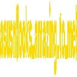
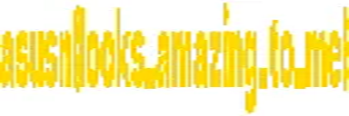

# フラグ絵文字 : Misc

「お笑いエンジニア」Discordには`:flag:`という絵文字があるらしい。

一体なんと書かれているんだろう？

Difficulty Level : easy  
Point : 448  
Solves : 48  

# Solution

:flag:という絵文字を以下に示す。  
  
これはDiscordから絵文字画像をブラウザで開いて、さらに保存したものである。
これをpaintツールを用いて横幅を伸ばしてflag文字列の読み取りを試みる。
  
flagが得られた。

`asusn{looks_amazing_to_me}`
