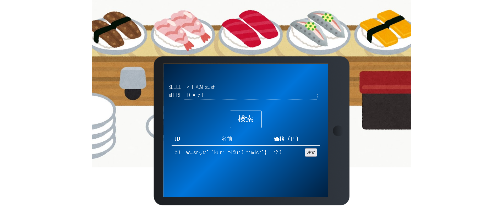

# SQL寿司 : Web

[SQL to choose sushi](https://youtu.be/_2NgwNbEYrw?t=64)

お寿司お寿司！

最後のお寿司(ID: 50)の名前がフラグだよ!

※ sqlmapなどの自動テストツールを、リモートサーバーに対して利用しないでください。

（参考までにソースコードを添付しましたが、問題を解くためには必ずしも読む必要はありません。）  
http://35.189.153.223:8000/ 

Hint  
sqlの制限はここ！
```
if "id" in sql:
    return render_template('index.html', sushi_list=[], error="「id」は禁止されています!")
sushi_list = get_sushi(sql)
return render_template('index.html', sushi_list=sush
```

Attachment  
[sqlsushi.zip](sqlsushi.zip)  

Difficulty Level : easy  
Point : 240  
Solves : 106

# Solution

とりあえず、記載のリンクを開く。  
 
問題文によるとflagはID=50のところにあるらしい。`ID=50`を出力させるSQL文を入力する。  
  
flagが得られた。

`asusn{3b1_1kur4_m46ur0_h4m4ch1}`
