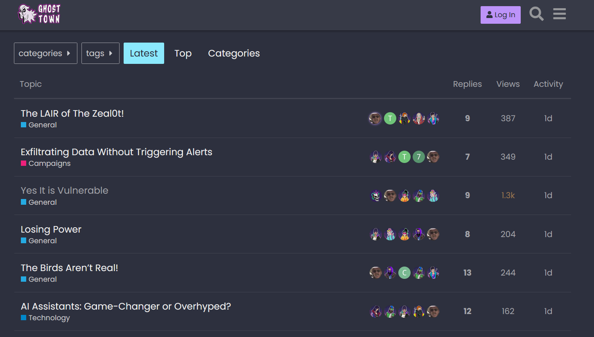
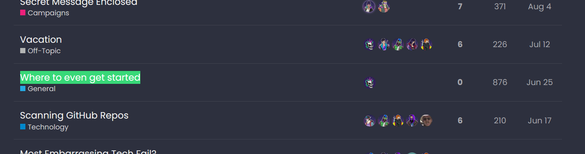
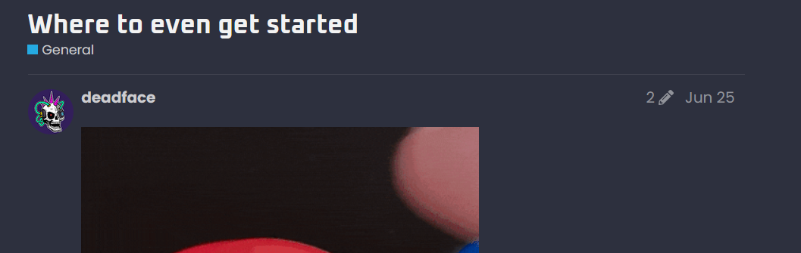

# Starter 2 : Starter

We need your help! DEADFACE has been wreaking havoc on several companies and individuals. Many of us have joined together to form Turbo Tactical, an organization of cybersecurity and infosec professionals and enthusiasts to help out DEADFACE's victims.

While performing some basic reconnaissance, we found a public Discourse forum called Ghost Town that DEADFACE uses to communicate with each other. We managed to get an insider to open the forum up to non-authenticated users. Use Ghost Town as a resource to find out what DEADFACE is up to and how they managed to execute their attacks.

[Ghost Town](https://ghosttown.deadface.io/)

There is a post titled "Where to even get started". Submit the flag as the username of the user that started the post and the date the post was made in this format: `flag{username_MMDD}`.

Example: flag{hackyboi_0615}
   
Point : 2  
Author : syyntax

# Solution

[Ghost Town](https://ghosttown.deadface.io/)を開く。  
  
タイトルが"Where to even get started"の投稿を文字列検索で探す。  
  
記事を開くと、記事の投稿者と投稿日時がdeadfaceとJun 25だと分かる。  
  
flag形式に直して、`flag{deadface_0625}`を提出するが、不正解となる。
日付がplayerの現地時間で表示されるようになっているようなので、UTF+0か主催者の現地時間かは分からないが、Jun 24でflagを提出すると、これが正しいflagであった。

`flag{deadface_0624}`
