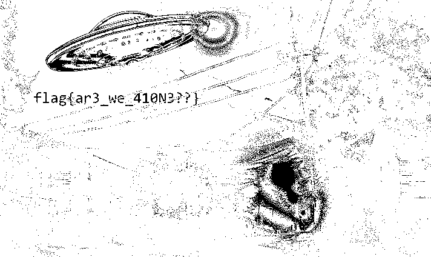

# Something in the Dark : Steganography

DEADFACE extracted a sensitive photo from Lytton Labs. As far as we can tell, it’s just a normal photo of a neighborhood at night, but the man who took the photo insists he saw something else. Here is the man’s original [tweet](https://tinyurl.com/2h8aj37p). He later added the following image below.

Submit the flag as `flag{flag_text_here}`.

[Download Image](didyouseeit.png) (334KB)  
SHA1: `aa80a85127e85e410fdb6a207396fe7a7d0f7ac1`

Point : 30  
Solved : 358  
Author : syyntax

# Solution

問題文より、画像の視覚情報からフラグを得られそうである。うさみみハリケーンに含まれる青い空を見上げればいつもそこに猫のステガノグラフィ解析を行う。  
赤色 ビット0 抽出で、フラグが見えた。  
  
flagが得られた。

`flag{ar3_we_410N3??}`
