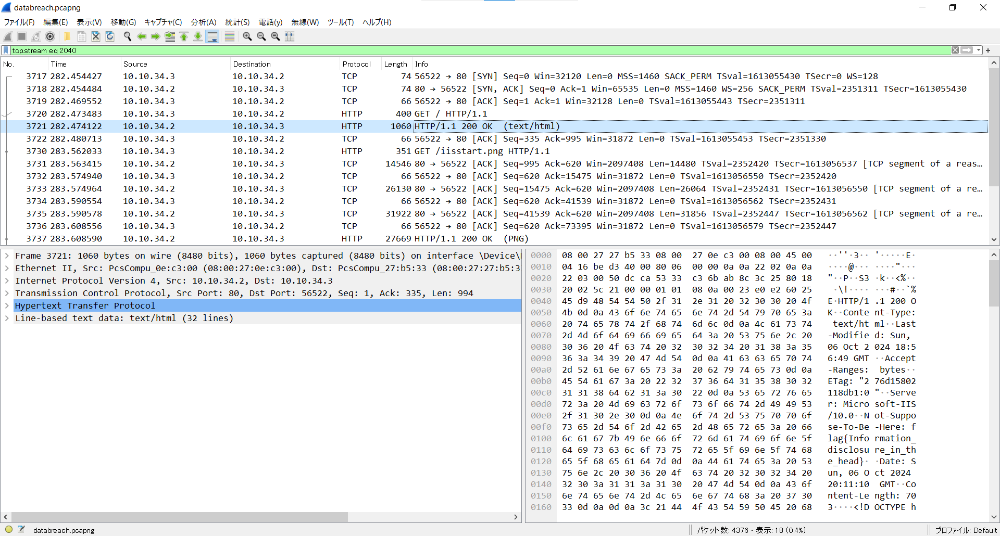
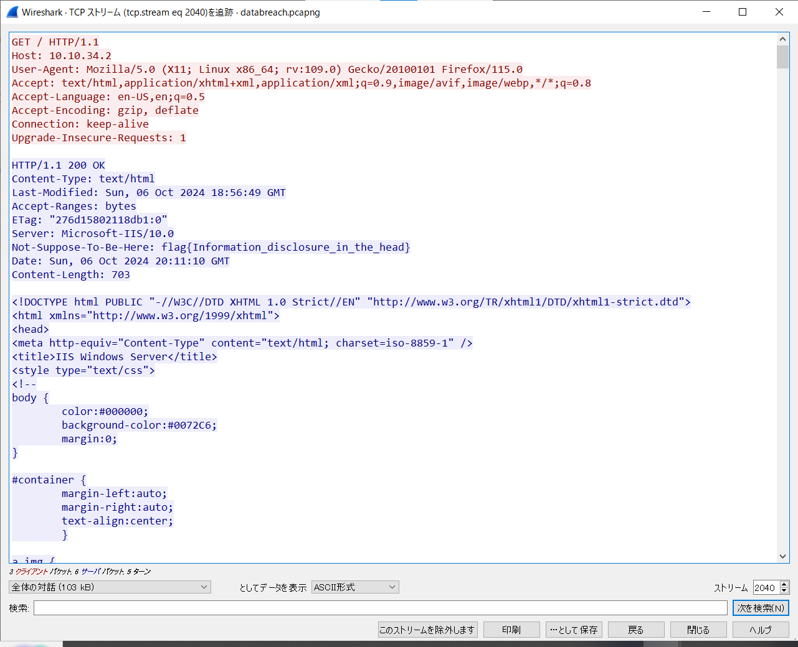

# Data Breach : Traffic Analysis

We suspect an internal employee is leaking sensitive information, but the source remains unclear. We've captured network traffic for analysis. Your mission is to investigate the data and locate the hidden flag.

Can we count on your expertise to track it down?

Submit the flag as `flag{flag-text}`.

[Download PCAP](databreach.zip) (342KB)  
SHA1: `48744d0b724fc30f660a7953b5e974320b60a47c`

Point : 25  
Solved :   
Author : RP-01?  

# Solution

添付のzipファイルを解凍すると`databreach.pcapng`ファイルが出てくる。これをWireSharkで開く。 
  
ざっくりと見ると、プロトコル欄でTCPやHTTPが散見される。`分析→追跡→TCPストリーム`で各ストリームを確認していく。  
  
ストリーム2024でflagが見つかった。

`flag{Information_disclosure_in_the_head}`
