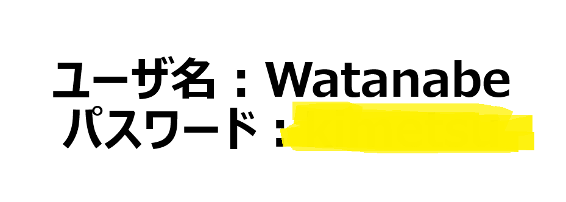
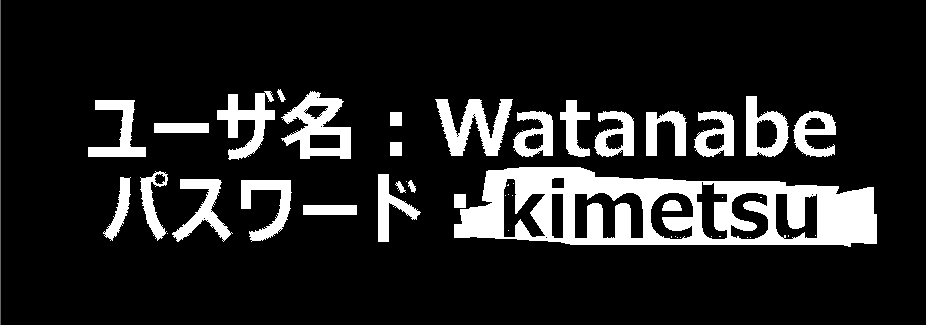

# blotting out:Misc

パスワードを答えてください。  
※教訓：中途半端に消すと消えなくなる可能性があります。  
ーーーーーーーーーーーーーーーーーーーーーーーーーー  
Please answer the password.  
※Lesson learned: There is a possibility that it will not disappear if you erase it half-heartedly.

attachment  
[nuritsubuchi.png](nuritsubuchi.png)

Point : 50

# Solution
添付ファイルを見てみる。  

おそらく、塗りつぶされている下にフラグのデータが残っているのだろう。
うさみみハリケーンのAoZoraSiroNeko.exeでステガノグラフィ解析する。赤色ビット0抽出で可読文字列が出てきた。

flagが得られた。

`kimetsu`
