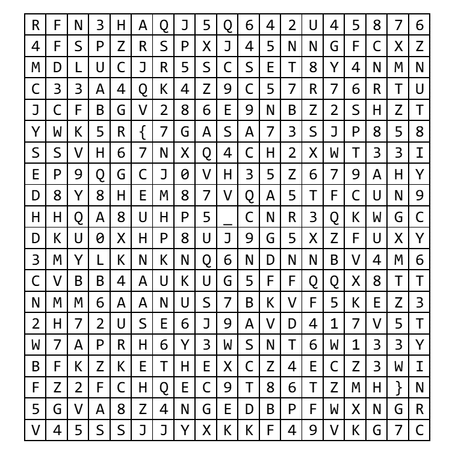

# can't view:Misc

友人からフラグが書かれたpdfファイルを貰ったが開けない、なぜだろう...  
※フラグ形式：FLAG{ *** }  
ーーーーーーーーーーーーーーーーーーーーーーーーーーー  
I received a PDF file with flags from a friend, but I can't open it, I wonder why...  
※Flag format：FLAG{ *** }

attachment  
[cant_view.pdf](cant_view.pdf)

Point : 50

# Solution
問題文の通り、添付のpdfファイルは開けないので、テキストエディタで開く。  
ファイルのマジックナンバーが`臼NG`であることが分かるので、拡張子をpdfからpngに修正して開く。  
以下の画像が見ることができる。  
  
明らかに、左上から右下に向かって、斜めにフラグがあるので、抽出する。

flagが得られた。

`FLAG{N07_9DFF113}`
