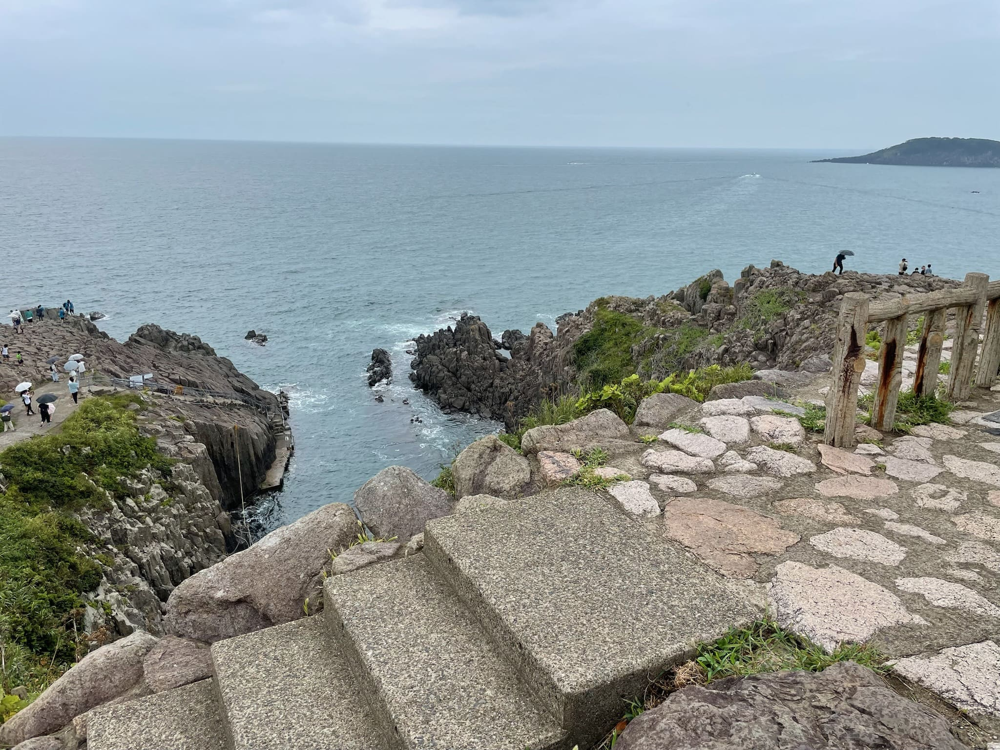
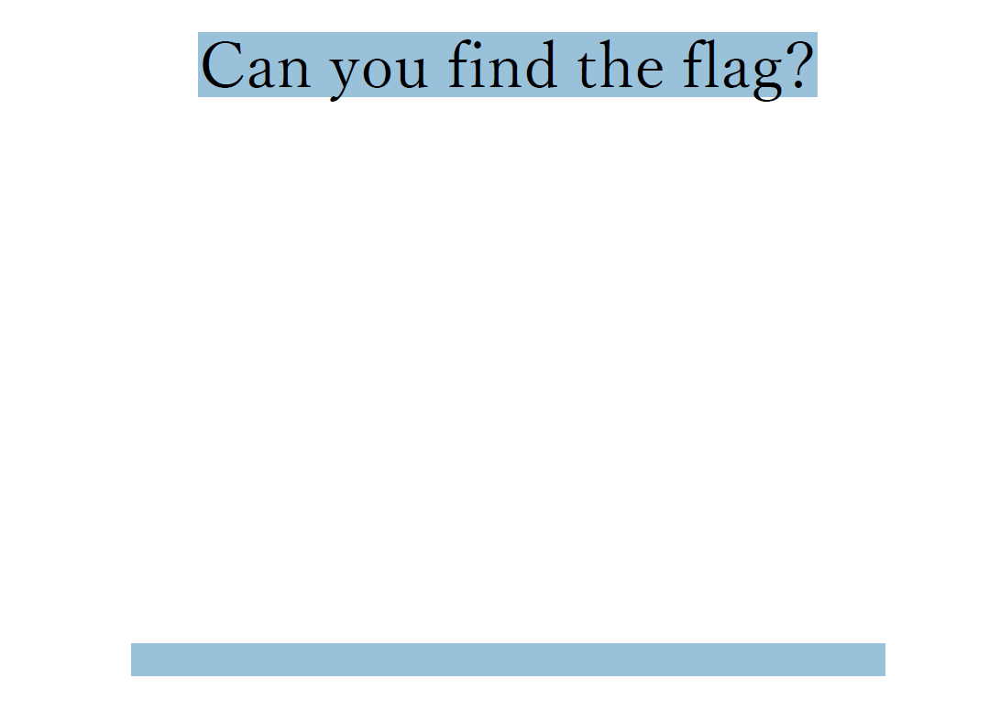

# stegano:Misc

フラグを見つけられるかな？  
※フラグ形式：FLAG{ *** }  
ーーーーーーーーーーーーーーーーーーーーーーーーーーー  
Can you find the flag?  
※Flag format: FLAG{ *** }

attachment  
[stegano.jpg](stegano.jpg)

Point : 100

# Solution
添付ファイルを見てみる。  

見た目から得られる情報はなさそう。  
`binwalk`で画像に他のファイルが含まれているかどうか確認するとPDFファイルの存在が判明する。
```
$ binwalk stegano.jpg

DECIMAL       HEXADECIMAL     DESCRIPTION
--------------------------------------------------------------------------------
0             0x0             JPEG image data, JFIF standard 1.01
555226        0x878DA         PDF document, version: "1.7"
555768        0x87AF8         Zlib compressed data, default compression
557091        0x88023         Zlib compressed data, default compression
558196        0x88474         Zlib compressed data, default compression
695749        0xA9DC5         Zlib compressed data, default compression
```
`binwalk -D='.*' stegano.jpg`でファイル抽出し、PDFファイルを開いてみる。  
"Can you find the flag?"の文字と共に、白文字列を発見。  
  
白文字をテキストエディタに貼り付けると`NzBqMW5iMEBGdWt1MV85cjNmM2M3dXIzfQ==`というBase64エンコード文字列が出てきた。  
cyberchefを使ってbase64デコードすると、`70j1nb0@Fuku1_9r3f3c7ur3}`というフラグの後半部分が出てきた。
前半部分を`strings`で探すと、フラグの前半部分が見つかる。
```
$ strings 878DA

%PDF-1.7
1 0 obj
<</Type/Catalog/Pages 2 0 R/Lang(ja) /StructTreeRoot 10 0 R/MarkInfo<</Marked true>>/Metadata 54 0 R/ViewerPreferences 55 0 R>>
...
...
a8hiifjhy2j2d
d9shm7tn3kzfa
FLAG{7h15_15_
```

flagが得られた。

`FLAG{7h15_15_70j1nb0@Fuku1_9r3f3c7ur3}`
