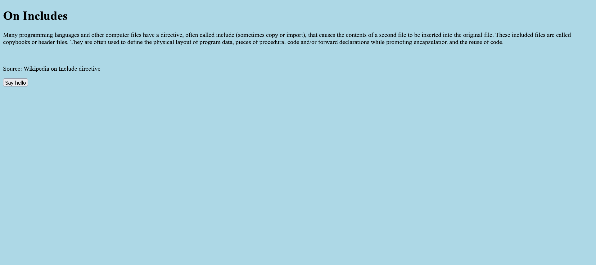
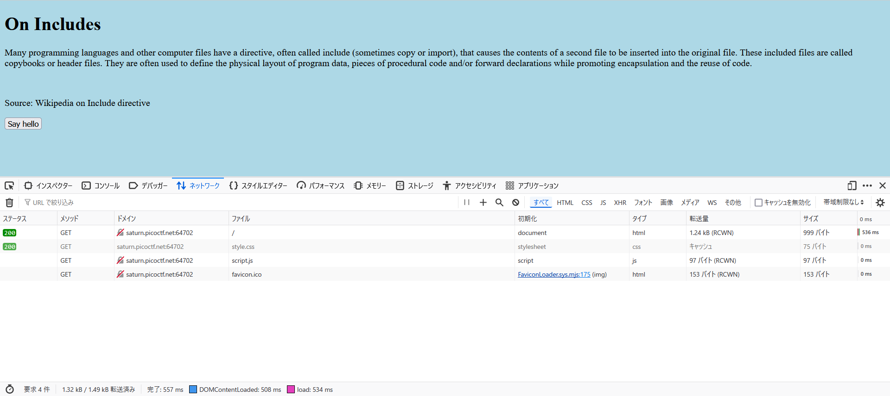
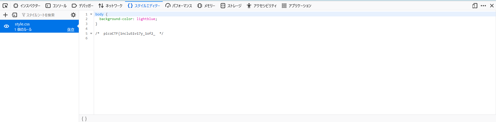
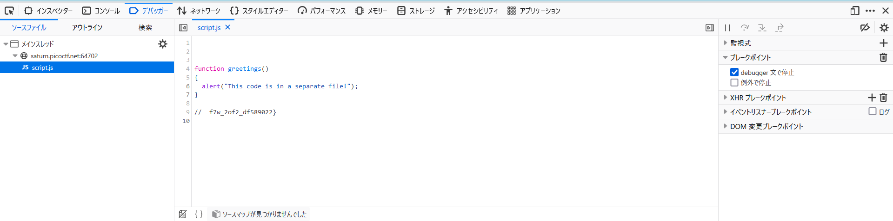

# Includes : Web Exploitation

Can you get the flag?  
Go to this [website](http://saturn.picoctf.net:64702/) and see what you can discover.

Author : LT 'syreal' Jones

# Solution

とりあえず、記載のリンクを開く。  
  
includeについての説明が書かれている。  
おそらくincludeに当たる部分を見れば良いだろう。  
Devtoolのnetworkタブを見てみる。  
  
syte.cssとscript.jsというファイルが読み込まれていることが分かる。  
それぞれのファイルを見てみる。  
  

flagが得られた。

`picoCTF{1nclu51v17y_1of2_f7w_2of2_df589022}`
