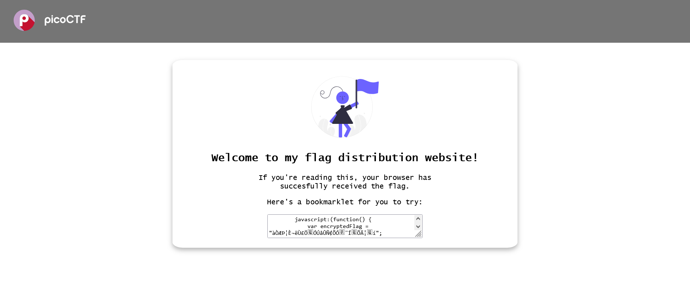
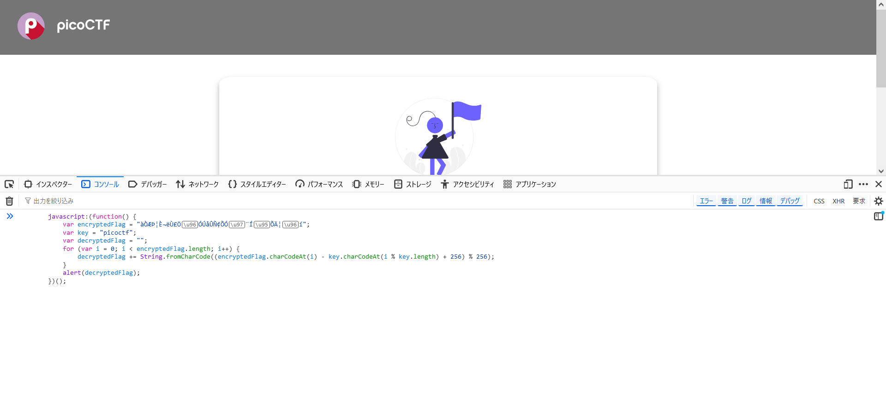
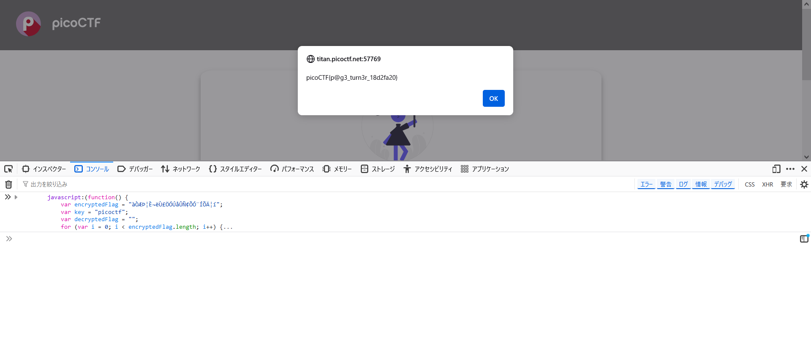

# Bookmarklet : Web Exploitation

Why search for the flag when I can make a bookmarklet to print it for me?  
Browse [here](http://titan.picoctf.net:57769/), and find the flag!

Author : Jeffery John

# Solution

とりあえず、記載のリンクを開く。  
  
何かコードが書いてある。bookmarkletらしい。  
謎コードを以下に示す。
```js
        javascript:(function() {
            var encryptedFlag = "àÒÆަȬë٣֖ÓÚåÛÑ¢Õӗ¨Í•ÕĦ–í";
            var key = "picoctf";
            var decryptedFlag = "";
            for (var i = 0; i < encryptedFlag.length; i++) {
                decryptedFlag += String.fromCharCode((encryptedFlag.charCodeAt(i) - key.charCodeAt(i % key.length) + 256) % 256);
            }
            alert(decryptedFlag);
        })();
    
```
このコードを実行するとflagが得られそうである。  
ブラウザで実行できるところの一つにconsoleがある。  
コンソールにコードを貼り付ける。  
  
実行する。  


flagが得られた。

`picoCTF{p@g3_turn3r_18d2fa20}`

# References
https://en.wikipedia.org/wiki/Bookmarklet
