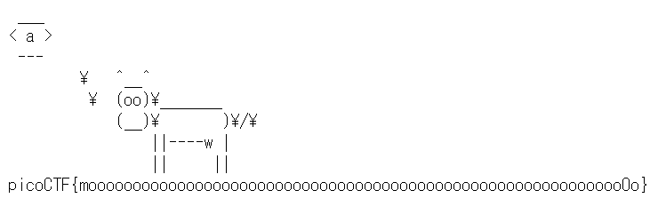

# caas:Web Exploitation

Now presenting [cowsay as a service](https://caas.mars.picoctf.net/)

attachment
* [index.js](index.js)

# Solution

とりあえず、記載のリンクに飛んでみると、`Make a request to the following URL to cowsay your message: https://caas.mars.picoctf.net/cowsay/{message}`
と書いてあった。そのままURLにアクセスすると以下のメッセージ付き牛が出てきた。

`{message}`の部分に入力した文字が牛からのメッセージとして出力されるようだ。
index.jsを見てみる。`const { exec } = require('child_process');`でシェルコマンドを実行できるようにし、`/usr/games/cowsay ${req.params.message}`で、入力した{message}を引数としてシェルコマンドを実行しているようだ。;で区切ることによって任意のコマンドを実行させられる。
/usr/games/cowsayとPATHが指定されているため、`;ls`でディレクトリの内容を出力させようとしたが、;の前に何らかの文字を入れる必要があったため、`a;ls`とした。

ディレクトリの中にfalg.txtを発見した。「falg」であって、「flag」ではないことに注意が必要。つい見間違って時間が溶けたので、こういうときはコピペした方が良い。\
で、実行コマンドのことであるが、`a;strings%20falg.txt`で可読文字を抜き出そうとしたが、stringsが使えなかったため、ファイル内容を表示させるcatを使い、`a;cat%20falg.txt`とした。URLで空白文字を扱うために、空白をURLエンコードした%20を用いる(普通に空白文字でも良かったらしい)。実行するとフラグが出てきた。

flagが得られた。

`picoCTF{moooooooooooooooooooooooooooooooooooooooooooooooooooooooooooo0o}`

ちなみに、これはOSコマンドインジェクションというらしい。

